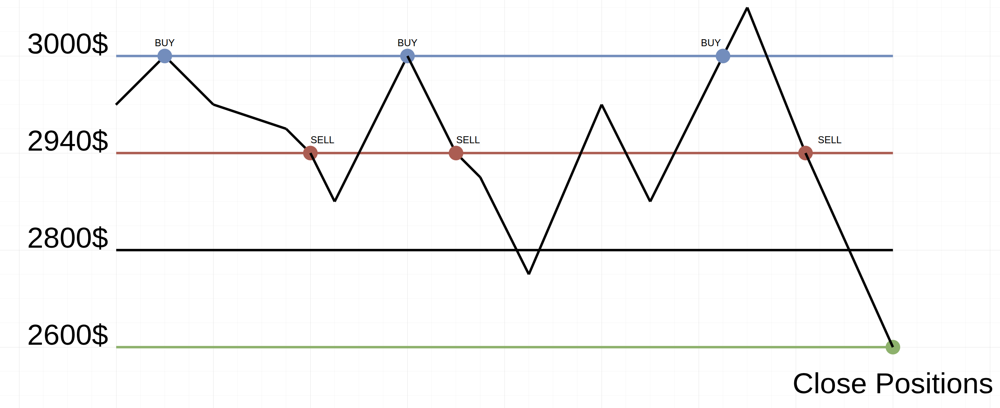

# AlgoTrader - Dynamic Hedge Grid Strategy for Bybit

A Rust-based algorithmic trading bot implementing the **Dynamic Hedge Grid (DynaGrid)** strategy on Bybit's Demo/Production hybrid environment.

## Features

- **Dual API Architecture**: Market data from Production, trading on Demo
- **Dynamic Hedge Grid**: Asymmetric position sizing (1.5x) with partial exits
- **EMA-Based Entry**: Trend-following initial position entry
- **Risk Management**: Daily loss limits, max exposure, emergency stop-loss
- **State Persistence**: SQLite database survives restarts
- **WebSocket + REST**: Real-time data with fallback polling

## Strategy Overview

The DynaGrid strategy profits from price oscillations within a range:

1. **Entry**: Enters based on EMA trend (uptrend = LONG, downtrend = SHORT)
2. **Grid Building**: As price oscillates, builds asymmetric positions (1.5x ratio)
3. **Partial Exits**: Closes positions in 3 tiers (30%, 30%, 40%) at profit targets
4. **Risk Control**: Max 4 grid levels, 7-day timeout, emergency stop-loss

## How It Works

Below is a visual representation of the DynaGrid strategy in action:



### Understanding the Diagram

The diagram above illustrates a typical DynaGrid trade on ETH:

- **$3,000 (Blue dots)**: Upper Zone - Add to LONG positions
- **$2,940 (Red dots)**: Lower Zone - Add to SHORT positions  
- **$2,600 (Green dot)**: Final exit - Close all positions profitably

#### Trade Flow Example:

```
Step 1: Price $3,000 → Buy 0.5 ETH (LONG entry)
        Position: Long 0.5 ETH, Short 0 ETH

Step 2: Price drops to $2,940 → Sell 1.0 ETH (SHORT, 2x the long)
        Position: Long 0.5 ETH, Short 1.0 ETH
        Net: -0.5 ETH (slightly short)

Step 3: Price returns to $3,000 → Buy 1.5 ETH (LONG, to make long 1.5x short)
        Position: Long 2.0 ETH, Short 1.0 ETH
        Net: +1.0 ETH (net long)

Step 4: Price drops to $2,940 → Sell 3.0 ETH (SHORT, 1.5x the long)
        Position: Long 2.0 ETH, Short 4.0 ETH
        Net: -2.0 ETH (net short)

Step 5: Price drops further to $2,600 → Close ALL positions
        LONG loss: 2.0 ETH × ($3,000 - $2,600) = -$800
        SHORT profit: 4.0 ETH × ($2,940 - $2,600) = +$1,360
        Net Profit: +$560 ✓
```

**Key Insight**: By always making the position in the breakout direction 1.5x larger, the strategy profits regardless of which way price ultimately moves.

## Quick Start

### 1. Prerequisites

- Rust 1.70+ (`rustc --version`)
- Bybit account with:
  - **Production API Key** (for market data)
  - **Demo API Key** (for trading)

### 2. Interactive Configuration

Run the setup script:

```bash
./setup.sh
```

Or manually configure (see [Configuration](#configuration) below).

### 3. Build and Run

```bash
# Build release binary
cargo build --release

# Run the bot
./target/release/algotrader
```

## Configuration

Configuration is loaded from (in priority order):
1. Environment variables (`BOT_*`)
2. `config/production.toml`
3. `config/default.toml`

### Minimal Configuration

Create `config/production.toml`:

```toml
[api.production]
key = "YOUR_PRODUCTION_API_KEY"
secret = "YOUR_PRODUCTION_API_SECRET"

[api.demo]
key = "YOUR_DEMO_API_KEY"
secret = "YOUR_DEMO_API_SECRET"

[strategy.dynagrid]
symbol = "ETHUSDT"
position_risk_percentage = 0.02  # 2% of free USDT per trade
```

### Full Configuration Reference

```toml
[bot]
name = "AlgoTrader-DynaGrid"
version = "0.1.0"
log_level = "info"  # Options: trace, debug, info, warn, error
data_dir = "./data"

[api.production]
key = "${PROD_API_KEY}"           # Required: Production API key
secret = "${PROD_API_SECRET}"     # Required: Production API secret
base_url = "https://api.bybit.com"
ws_url = "wss://stream.bybit.com/v5/public/linear"
rate_limit_requests = 50
rate_limit_window_ms = 1000

[api.demo]
key = "${DEMO_API_KEY}"           # Required: Demo API key
secret = "${DEMO_API_SECRET}"     # Required: Demo API secret
base_url = "https://api-demo.bybit.com"
rate_limit_requests = 50
rate_limit_window_ms = 1000

[database]
path = "./data/algotrader.db"
backup_enabled = true
backup_interval_hours = 24
backup_retention_days = 30

[risk]
max_daily_loss_pct = 2.0          # Stop trading after 2% daily loss
max_total_exposure_pct = 50.0     # Max 50% of account in positions
emergency_stop_loss_pct = 5.0     # Close all at 5% strategy loss

[strategy.dynagrid]
enabled = true
symbol = "ETHUSDT"                # Trading pair (e.g., BTCUSDT, ETHUSDT)
position_risk_percentage = 0.02   # Risk per trade (2% of free USDT)
grid_range_pct = 2.0              # Grid range: 2% = ±1% from entry
position_sizing_factor = 1.5      # 1.5x sizing for winning side
max_grid_levels = 4               # Maximum grid levels before forced exit
min_entry_interval_minutes = 60   # Min time between entries
max_hold_time_hours = 168         # Max 7 days holding
leverage = 5                      # Position leverage

[strategy.dynagrid.entry]
# Entry mode: "ema_trend", "immediate", or "wait_for_zone"
mode = "ema_trend"
ema_candles = 20                  # Candles for EMA calculation (5-100)
ema_timeframe = "15"              # Timeframe: "5", "15", "60", "240" minutes
ema_fallback = true               # Wait for zone if no clear trend

[strategy.dynagrid.exit]
partial_exit_enabled = true
partial_exit_levels = 3           # Number of partial exit tiers
partial_exit_percentages = [30, 30, 40]  # % to close at each tier
partial_exit_multipliers = [1.0, 2.0, 3.5]  # Distance multipliers of grid_range
```

### Environment Variables

All config values can be set via environment variables:

```bash
export BOT_API_PRODUCTION_KEY="your_prod_key"
export BOT_API_PRODUCTION_SECRET="your_prod_secret"
export BOT_API_DEMO_KEY="your_demo_key"
export BOT_API_DEMO_SECRET="your_demo_secret"
export BOT_STRATEGY_DYNAGRID_SYMBOL="ETHUSDT"
export BOT_STRATEGY_DYNAGRID_POSITION_RISK_PERCENTAGE="0.02"
```

Variable naming: `BOT_` + section + field (uppercase, underscores).

## API Key Setup

### 1. Production API (Read-Only)

Used for market data (prices, orderbook, funding rates).

1. Log in to [Bybit](https://www.bybit.com/)
2. Go to **Account & Security** → **API Management**
3. Create new key with permissions:
   - ✅ **Read-Only** (Position, Order, Wallet)
   - ❌ No trading permissions needed
4. Save Key and Secret

### 2. Demo API (Trading)

Used for actual trading (orders, positions).

1. Go to [Bybit Demo Trading](https://www.bybit.com/demo-trading)
2. Click **Demo Trading** in top menu
3. Go to **API Management**
4. Create new key with permissions:
   - ✅ **Orders** (Place/Cancel)
   - ✅ **Positions** (Read/Modify)
   - ✅ **Wallet** (Read)
5. Save Key and Secret

⚠️ **Important**: Demo API uses **different** credentials than production!

## Strategy Parameters Explained

### Entry Configuration

| Parameter | Description | Options |
|-----------|-------------|---------|
| `mode` | How to decide entry direction | `ema_trend`: Follow EMA slope<br>`immediate`: Always LONG<br>`wait_for_zone`: Wait for price to hit zone |
| `ema_candles` | Number of candles for EMA | 5-100 (default: 20) |
| `ema_timeframe` | Candle timeframe | `5`, `15`, `60`, `240` minutes |
| `ema_fallback` | Action if no trend | `true`: Wait for zone<br>`false`: Enter LONG |

### Grid Configuration

| Parameter | Description | Example |
|-----------|-------------|---------|
| `grid_range_pct` | Total range between zones | 2% = ±1% from entry price |
| `position_sizing_factor` | Multiplier for winning side | 1.5x = 50% larger position |
| `max_grid_levels` | Max oscillations before exit | 4 levels = 4 complete cycles |

### Risk Configuration

| Parameter | Description | Default |
|-----------|-------------|---------|
| `position_risk_percentage` | % of free USDT per initial entry | 2% |
| `max_daily_loss_pct` | Stop trading after daily loss | 2% |
| `max_hold_time_hours` | Force exit after holding time | 168 hours (7 days) |
| `emergency_stop_loss_pct` | Close all at strategy loss | 5% |

## Running the Bot

### Development Mode

```bash
cargo run
```

### Production Mode

```bash
cargo build --release
./target/release/algotrader
```

### With Custom Config

```bash
BOT_CONFIG_PATH="./config/myconfig.toml" ./target/release/algotrader
```

## Monitoring

### Logs

Logs are written to stdout and `./logs/` directory (when configured).

```bash
# View logs with filtering
RUST_LOG=info ./target/release/algotrader

# Debug mode
RUST_LOG=debug ./target/release/algotrader
```

### Database

SQLite database stores:
- Strategy state (positions, grid levels)
- Trade history
- Funding fee records
- Event log

Query with:
```bash
sqlite3 ./data/algotrader.db "SELECT * FROM trade_history ORDER BY created_at DESC LIMIT 10;"
```

### Risk Metrics

The bot periodically logs risk metrics:

```
Risk Metrics - Daily P&L: -0.50% (-50.00 USDT), Exposure: 25.00%, Trades: 5, Loss Streak: 2
```

## Troubleshooting

### "Configuration error: 'strategy.dynagrid.symbol' is required"

You haven't set the trading symbol. Either:
- Add `symbol = "ETHUSDT"` to config file
- Set `export BOT_STRATEGY_DYNAGRID_SYMBOL="ETHUSDT"`

### "Authentication failed"

- Verify API keys are correct
- Ensure Production and Demo keys are not swapped
- Check key permissions (Demo needs trading, Production needs read-only)

### "Insufficient margin"

- Check Demo account has enough USDT
- Reduce `position_risk_percentage` or `leverage`

### "No clear EMA trend"

- Market may be ranging - bot will wait or use fallback
- Try different `ema_timeframe` (e.g., `5` for more sensitivity)

## Example Scenarios

### Scenario 1: ETH Ranging Between $2900-$3100

```
Entry: LONG 0.5 ETH @ $3000 (EMA shows uptrend)
Price drops to $2940: SHORT 0.75 ETH
Price returns to $3000: LONG 1.125 ETH (total 1.625 ETH)
Price drops to $2940: SHORT 2.437 ETH (total 3.187 ETH)
Price breaks down to $2850: Exit all, SHORT profit > LONG loss
```

### Scenario 2: BTC Trending Up

```
Entry: LONG 0.1 BTC @ $65000 (EMA shows strong uptrend)
Price never hits lower zone, keeps rising
Partial exits at +1%, +2%, +3.5% grid range
Final exit with profit on LONG, small loss on any SHORT hedges
```

## Safety Features

1. **Demo Trading Only**: All trades execute on Demo account
2. **Daily Loss Limit**: Stops trading after 2% daily loss
3. **Emergency Stop Loss**: Closes all at 5% strategy loss
4. **Max Grid Levels**: Prevents unlimited position growth
5. **Position Sizing**: Based on free USDT, not total balance

## Development

### Running Tests

```bash
cargo test
```

### Project Structure

```
algotrader/
├── src/
│   ├── api/          # Bybit API clients (REST + WebSocket)
│   ├── config/       # Configuration management
│   ├── db/           # SQLite database layer
│   ├── risk/         # Risk manager
│   ├── strategy/     # DynaGrid strategy implementation
│   ├── error.rs      # Error types
│   ├── lib.rs        # Library entry
│   └── main.rs       # Application entry
├── config/           # Configuration files
├── data/             # SQLite database (created at runtime)
└── Cargo.toml
```

## License

MIT License - See LICENSE file

## Disclaimer

⚠️ **Trading Risk Warning**

- This bot trades on **Demo account** - no real money is at risk
- Always test thoroughly before any production use
- Past performance does not guarantee future results
- Cryptocurrency trading carries significant risk
- You may lose all your capital

The authors are not responsible for any financial losses incurred through the use of this software.

## Support

For issues and feature requests, please use GitHub Issues.

---

**Happy Trading! 🚀**
